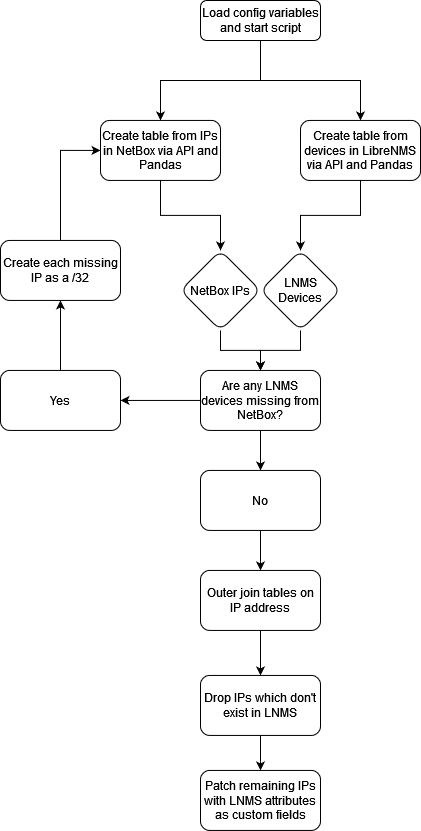

# LibreNMS/NetBox Sync

Script which uses LibreNMS polling data to create and update IP Address records in NetBox. My initial use case didn't involve device objects, so custom fields for IPs are used to populate polling data. In the future this will update devices as well.



## Setup

1. In NetBox, create custom fields for IP Addresses with these slugs:

- device_id
- sysName
- sysDescr
- hardware
- os
- last_polled
- serial

2. Clone the repository to a server with HTTP/HTTPS reachability to NetBox and LibreNMS:

```
mkdir ~/netbox-lnms-sync && cd ~/netbox-lnms-sync
git clone https://github.com/iansolt/netbox-ips-from-librenms.git
```

3. Fill out all fields in config_example.py and rename to config.py. A log file will save to the current directory by default.

#### Example config

```
NETBOX_TOKEN = '153540136603538'
LIBRE_TOKEN = '789971942261988'
NETBOX_URL = 'https://netbox.example.local/'
LIBRE_URL = 'https://librenms.example.local/'
VERIFY_SSL = True
LOG_FILE = '~/netbox-lnms-sync/netbox-lnms-sync.log'
```

```
mv ~/netbox-lnms-sync/config-example.py ~/netbox-lnms-sync/config.py
```

4. Create a new virtual environment and install the requirements from requirements.txt:

```
cd ~/netbox-lnms-sync
python3 -m venv venv
source venv/bin/activate
pip install -r requirements.txt
```

5. Optionally, create a cron task to run the script on a schedule. For example, to run it nightly at 4AM: 

```
echo "0 4 * * * ~/netbox-lnms-sync/venv/bin/python ~/netbox-lnms-sync/netbox-lnms-sync.py" | crontab -
```

## Troubleshooting
Review the log file defined in config.py to troubleshoot the script. Unexpected API responses will be logged as errors, which may indicate an invalid configuration. The log will look like this when functioning correctly.

```
12-Jun-24 12:02:03 root - INFO - Initiating sync
12-Jun-24 12:02:03 root - INFO - Pulling data from NetBox
12-Jun-24 12:02:33 root - INFO - Retrieved 1000 IP Address records from NetBox
12-Jun-24 12:02:33 root - INFO - Pulling data from LibreNMS
12-Jun-24 12:04:17 root - INFO - Retrieved 200 device records from LibreNMS
12-Jun-24 12:04:17 root - INFO - Creating new devices in NetBox
12-Jun-24 12:04:52 root - INFO - Created 50 IP records
12-Jun-24 12:04:52 root - INFO - Pulling data from NetBox
12-Jun-24 12:05:25 root - INFO - Retrieved 1150 IP Address records from NetBox
12-Jun-24 12:05:25 root - INFO - Updating NetBox with polling data
12-Jun-24 12:17:24 root - INFO - Updated 1150 IP records
12-Jun-24 12:17:24 root - INFO - Completed sync
```
